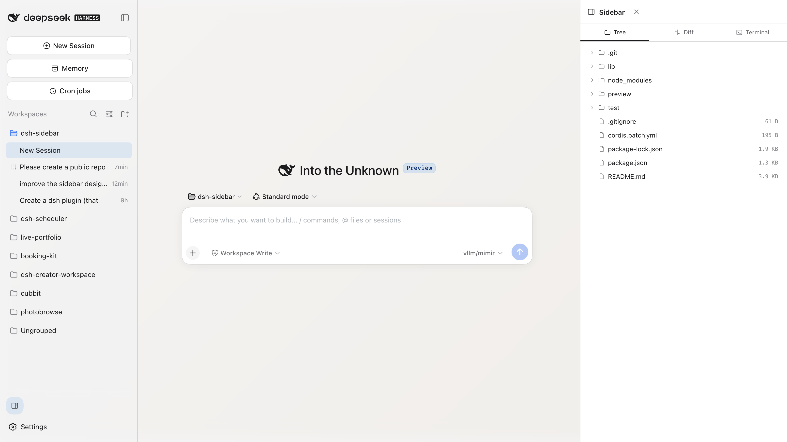
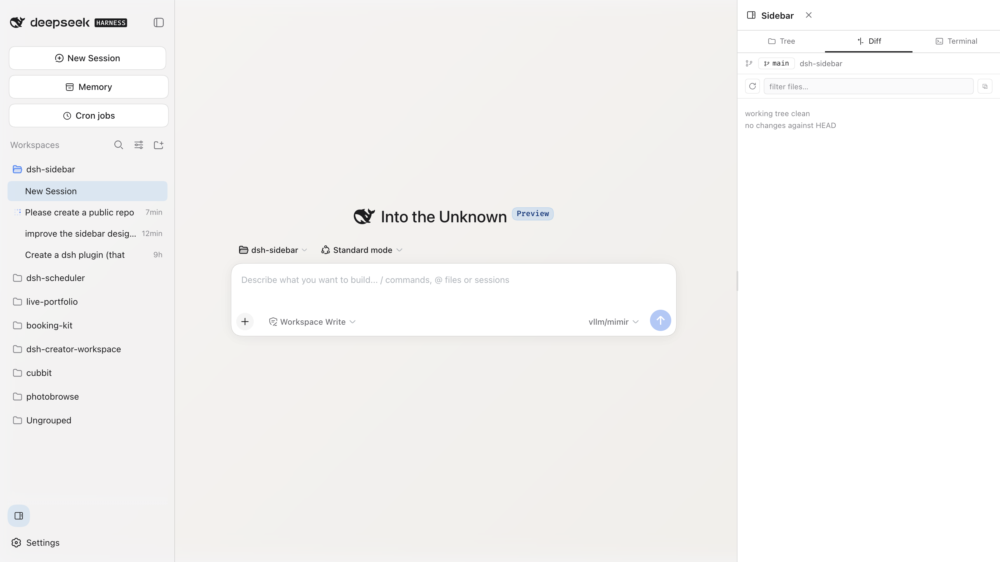
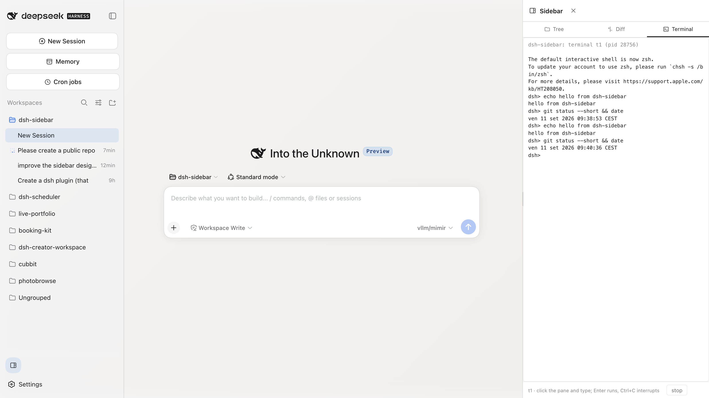

# dsh-sidebar

A [DeepSeek Harness](https://github.com/JacopoBonta) plugin that docks a side
panel to the right of the web interface. The panel has three tabs:

| Tree — workspace file explorer | Diff — git status + unified diff | Terminal — one bash PTY per workspace |
| --- | --- | --- |
|  |  |  |

- **Tree** — a workspace file explorer. Directories expand lazily per level;
  clicking a file previews its first 64 KiB in a bottom pane.
- **Diff** — git status for the selected workspace plus the unstaged + staged
  unified diff, rendered as per-file collapsible sections with sticky headers
  and `+adds −dels` hunk stats. A file list above the diff shows each changed
  file with a kind badge (A/M/D/R/?), staged/unstaged tags, and stats; clicking
  a row jumps to that file's section. A toolbar offers a path filter, copy
  diff, and refresh; a changed-file count appears on the tab strip. The repo
  row shows the repository name, the current branch (or `detached @ <sha>`),
  and a worktree chip when the workspace is a linked worktree (hover the chip
  for the full worktree list).
- **Terminal** — one interactive bash PTY per workspace, sandbox-confined by
  the deployment's policy. Click the pane and type; Enter runs, Ctrl+C
  interrupts, paste is supported, and the scrollback survives panel toggles.

The panel mounts as a `shell.overlay` slot entry (frame-wide floating layer)
and a toggle button appears beside Settings at the sidebar foot
(`sidebar.footer.action` slot), using the host's `--dsw-alias-*` design tokens.

## Install

```sh
dsh plugin --profile web add dsh-sidebar
# or
dsh plugin --profile web add JacopoBonta/dsh-sidebar
```

From a local checkout:

```sh
dsh plugin --profile web add /path/to/dsh-sidebar
```

The install registers the plugin in the `web` profile and, because the package
declares `dsh.bundle.patch` (`cordis.patch.yml`), appends it to the profile's
bundle list automatically. Restart the web surface afterwards and reload the
GUI page.

## Exposed endpoints

The host half provides a `sidebarFs` SRC-typert gateway service over the
`/api` channel (consumed by the panel via `ctx.connection.rpc.call`):

| Endpoint | Purpose |
| --- | --- |
| `sidebarFs/listDir` | Direct children of a directory inside a registered workspace |
| `sidebarFs/readText` | One text file, capped at 1 MiB, with truncation flag |
| `sidebarFs/diff` | `git status --porcelain` + combined unstaged/staged diff (plus per-side `parts`) for a workspace root, plus repo identity (name, branch, worktrees) |
| `sidebarFs/termSpawn` | Spawn (or reuse) one bash PTY per workspace root |
| `sidebarFs/termRead` | Drain terminal output since a byte offset |
| `sidebarFs/termWrite` | Write bytes to a terminal's stdin |
| `sidebarFs/termKill` | Terminate a terminal |
| `sidebarFs/workspaces` | Registered workspace rows for the picker |

Every path-taking method resolves the path and asserts it stays inside a
registered workspace before touching the filesystem.

## Security notes

- Terminal argv is confined through `ctx.sandbox.confine` whenever the
  deployment's sandbox mode is not `danger-full-access`.
- File reads are capped (1 MiB hard cap, 64 KiB preview through the panel) and
  diff output at 256 KiB per git invocation; terminal scrollback is a 512 KiB
  ring per terminal.
- Terminals run `bash --noprofile --norc -i` with `TERM=dumb`, so output stays
  plain text (no cursor addressing to render).

## Requirements

- Node >= 20.
- The full DSH web profile runtime (the plugin's imports resolve through the
  profile's `node_modules` walk-up; `@deepseek-ai/cordis` is declared as a peer
  dependency).

## Development

```sh
npm install     # brings in @deepseek-ai/cordis for tests
npm run check   # syntax-checks lib/index.js and lib/client.js
npm test        # pure-function tests (ring buffer, tail, descriptors, errors, worktree parsing)
```

`lib/index.js` is the host half (cordis service + gateway); `lib/client.js` is
the browser half (ModuleLoader module with the panel UI).

## License

MIT
